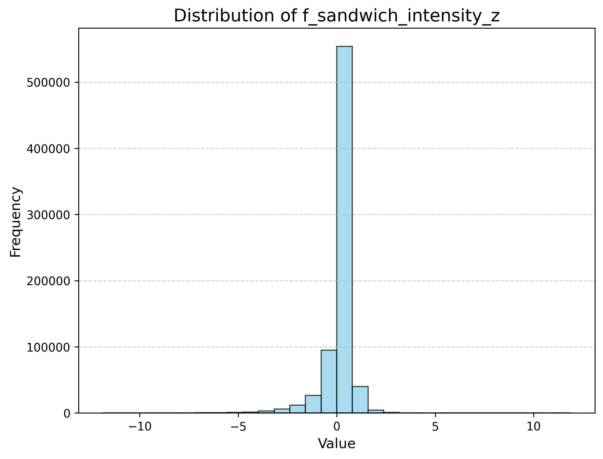
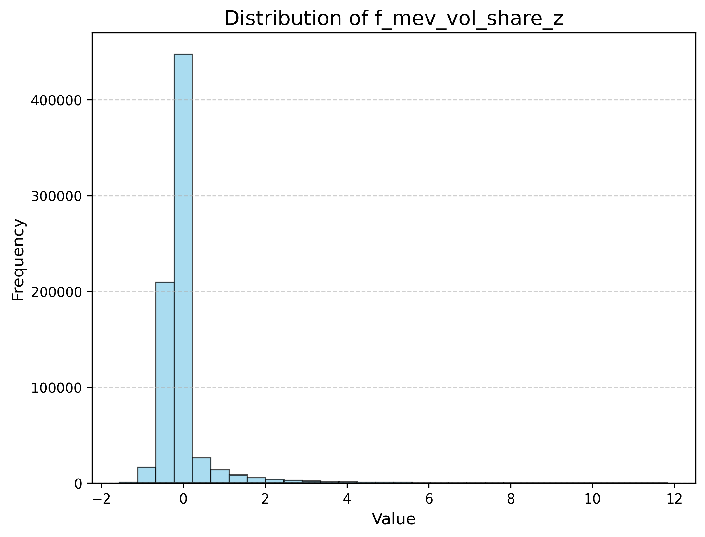
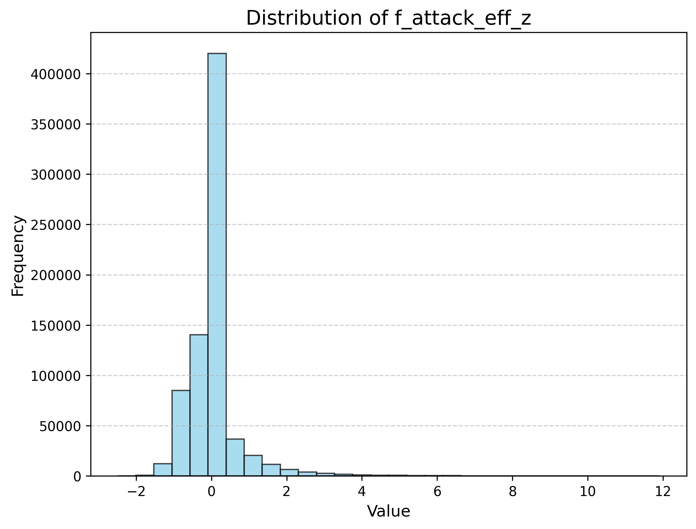

# On-Chain MEV Signals for Cryptocurrency Timing

**Do Ethereum MEV flows predict BTC volatility? A factor study on sandwich attacks, plus a Rust MEV bot reference implementation.**

`Python` · `vectorbt` · `Rust` · `Dune Analytics` · `2019–2026` · `60 factor charts`

---

## TL;DR

- Built a multi-source dataset (**2019–2026**): BTC/USDT high-frequency OHLCV + Ethereum **sandwich-attack traces** extracted from Dune Analytics.
- Designed **3 MEV-native features** capturing on-chain adversarial flow: attack *intensity*, attacked *volume share*, and *attack efficiency*.
- MEV features carry strong standalone information (**|IC| 0.10 – 0.27**) and are close to orthogonal to classical price/volume factors — they describe a part of the market that price data does not see.
- Used **Jaccard-similarity spectral clustering** to group and prune the collinear factor zoo, then tested two prediction paths: **direction** (return sign) and **volatility timing** (absolute return).
- The **volatility-timing path is the robust one**: rising sandwich activity is a leading indicator of turbulence / liquidity stress, not of direction.
- Cost analysis is the punchline: a frictionless backtest reached **~180× cumulative excess return** in the original study, but the strategy **breaks even at only ~0.23 bp of fees**, and a fee-inclusive run turned sharply negative. The alpha is real but execution-bound.
- Ships the execution layer as well: a **Rust MEV bot** (pending-transaction monitoring, Uniswap-V2 math, on-chain pair scanning) used to observe and prototype sandwich execution.

---

## 1. Motivation

MEV (Maximal Extractable Value) is the profit extracted by reordering, inserting or censoring transactions in a block. Sandwich attacks — buying before a victim's swap and selling right after — are its most visible form, and they are **on-chain observable**: every attack is a public sequence of swaps.

That makes MEV data an unusual signal source:

- It measures **adversarial, informed flow** rather than aggregate volume.
- It is a **stress indicator**: attacks cluster around liquidity fragmentation, high volatility and retail order-flow imbalance.
- It is **structurally different** from exchange OHLCV data — a candidate orthogonal alpha source, especially for volatility rather than direction.

This study asks: can on-chain MEV activity be turned into tradable timing signals for BTC, and what does execution cost do to them?

---

## 2. Data

| Block | Frequency | Content | Source |
|---|---|---|---|
| Price / volume | High-frequency bars | BTC/USDT OHLCV | Exchange data (CEX) |
| On-chain MEV | Event-level | Sandwich attacks, victim/attacker amounts, fees, tx traces | Dune Analytics (`dune_client`) |

- Coverage: **2019-01 – 2026-01** (2,584 days in the labeled dataset).
- Sampling: 745,326 aligned observations across the factor panel.
- Raw parquet data (1 GB+) is **not redistributed** here. `factors/dune/mev_factor.ipynb` contains the Dune extraction queries and requires a `DUNE_API_KEY` environment variable.

---

## 3. MEV-native features

| Feature | Definition | Economic reading |
|---|---|---|
| `f_sandwich_intensity_z` | Sandwiched transactions per unit time, standardized | Frequency of adversarial intervention |
| `f_mev_vol_share_z` | Attacked volume / total volume | How much flow is being exploited |
| `f_attack_eff_z` | Victim volume / attacker volume | Profitability of attacks = market vulnerability |

Plus **26+ classical technical factors** (momentum, mean-reversion, volume/liquidity, volatility, intraday structure, Alpha101-style) implemented on top of `vectorbt` in [`factors/ohlcv_factor.py`](factors/ohlcv_factor.py): ROC, MA deviation, MACD, TSI, Bollinger width/%B, CCI, dist-to-high/low, KDJ, OBV, VWAP deviation, CMF, volume surge, MFI, ATR, GK volatility, realized vol, HL spread, skew/kurtosis, bar structure, price-volume correlation, time-series volume rank and more.

---

## 4. Methodology

```
Dune extraction ──► MEV features ─┐
                                  ├─► IC screen (Spearman) ──► correlation pruning
OHLCV ──► 26+ tech factors ───────┘              │
                                                 ▼
                        Jaccard-similarity spectral clustering
                                                 │
                        ┌────────────────────────┴───────────────────────┐
                        ▼                                                ▼
              direction prediction                            volatility (|return|) prediction
                        └────────────────────────┬───────────────────────┘
                                                 ▼
                                       signal backtests (vectorbt)
```

1. **IC screening.** Rank-IC (Spearman) of every factor against forward returns; MEV features are also tested against |returns| to capture the volatility channel.
2. **De-correlation.** Factors are pruned on pairwise correlation, then clustered by **spectral clustering on a Jaccard similarity matrix** so that each cluster carries one theme (momentum, liquidity, volatility, MEV, …).
3. **Group tests.** Cluster representatives are tested on direction and absolute-return targets (`group_test*.ipynb`), producing the 60 quantile/IC charts in [`figures/factor_analysis/`](figures/factor_analysis).
4. **Signal construction & cost sensitivity.** Cluster signals are combined and backtested with `vectorbt`, sweeping fee assumptions to locate the break-even.

---

## 5. Results

### MEV features vs. classical factors (standalone IC)

| Factor | Target | IC (Spearman) |
|---|---|---|
| `f_sandwich_intensity_z` | forward return | **+0.104** |
| `f_mev_vol_share_z` | forward return | **−0.273** |
| `f_attack_eff_z` | forward return | **−0.186** |
| most technical factors (e.g. ROC/CCI/MA-dev) | forward return | ≈ −0.006 … +0.006 |

Two observations:

- **Magnitude.** MEV features are an order of magnitude more informative than typical technical factors on this sample (caution: measured on the full sample, so treat these as screening evidence, not out-of-sample performance).
- **Orthogonality.** Correlation with price/volume factors is low, so they survive pruning and clustering as a distinct theme rather than a proxy of volatility.







### Direction vs. volatility

- **Direction:** the aggregated signal reached a rank IC of ≈ **0.007** — statistically present but economically thin.
- **Volatility (|return|):** MEV clusters rank among the strongest groups; sandwich activity spikes precede elevated volatility and liquidity stress. This is the economically sensible channel: MEV measures *fragility*, not *direction*.

### Cost sensitivity — the real result

| Backtest assumption | Outcome (original study) |
|---|---|
| Frictionless | ~**180×** cumulative excess return |
| Realistic fees | strongly negative (a fee-inclusive run: −95% with ~2,100 trades) |
| Break-even round-trip fee | **≈ 0.23 bp** |

This is the study's most practical finding: the signal can be strong and still not survive retail cost structures. It implies the strategy class is viable only with **top-tier execution** (colocated infrastructure, maker rebates, fee tiering) — which is precisely why the repo also ships an execution layer.

---

## 6. Execution infrastructure (`mev-bot/`)

| Module | Language | Content |
|---|---|---|
| `mev-bot/python/` | Python | Prototype arbitrage bot ("Corridor Predator"): config, entry point, sample mempool feed. Partial prototype — its engine module is not included. |
| `mev-bot/rust/` | Rust | Complete reference implementation: pending-transaction mempool monitoring, Uniswap-V2 pricing math, DEX pair scanning, Solidity trigger contract, Discord alerting, CLI demo. |

The Rust bot (based on the MIT-licensed [AIO MEV](https://github.com/AIO-MEV/ETHEREUM-MEV-BOT) template — see [`mev-bot/rust/LICENSE`](mev-bot/rust/LICENSE)) requires a private key and RPC endpoint **via environment variables only**; no credentials are committed.

---

## 7. Repository layout

```
onchain-mev-crypto-timing/
├── factors/
│   ├── ohlcv_factor.py            # 26+ technical factor definitions (vectorbt)
│   ├── factor_ohlcv_create.py     # Batch factor computation
│   ├── factor_mev_create.ipynb    # Construction of the 3 MEV-native features
│   └── dune/mev_factor.ipynb      # Dune Analytics extraction of on-chain MEV data
├── backtest/
│   ├── backtest_03.ipynb          # IC screen → pruning → signal generation
│   ├── clustering.ipynb           # Spectral clustering (direction target)
│   ├── clustering_abs.ipynb       # Spectral clustering (volatility target)
│   ├── group_test*.ipynb          # Group factor tests (direction / abs / win-rate)
│   ├── test_tools.py              # Jaccard similarity, spectral clustering, plotting utils
│   └── similarity_matrix*.csv     # Factor similarity matrices
├── benchmark/
│   ├── test_fast.py               # Factor computation benchmark
│   └── test_perf.py               # Per-factor performance breakdown
├── figures/factor_analysis/       # Quantile / IC charts for every factor
├── mev-bot/
│   ├── python/                    # Prototype arbitrage entry point
│   └── rust/                      # Rust MEV bot (mempool + Uniswap-V2 math)
├── requirements.txt
└── LICENSE
```

---

## 8. Reproducing

```bash
python -m venv .venv && source .venv/bin/activate
pip install -r requirements.txt jupyterlab
```

1. **On-chain data:** run `factors/dune/mev_factor.ipynb` with `DUNE_API_KEY` set to rebuild the MEV dataset, or supply your own parquet.
2. **Factors:** `factors/factor_ohlcv_create.py` (technical) and `factors/factor_mev_create.ipynb` (MEV).
3. **Research:** open `backtest/backtest_03.ipynb` and follow the notebooks in order.
4. **Bot (optional):** `cd mev-bot/rust && cargo build --release`, after exporting `PRIVATE_KEY`, `NETWORK_RPC` (see `.env.example`). Use on a testnet first.

Data files (`*.parquet`) are excluded from the repository.

---

## 9. Limitations

- ICs for MEV features are measured on the full sample; the honest next step is walk-forward evaluation.
- BTC/USDT is the only traded asset; cross-asset robustness is untested.
- Break-even fee of ~0.23 bp means the strategy is effectively unreachable for most participants — the main practical conclusion.
- The MEV features rely on Dune-indexed data; availability and latency are not guaranteed at live trading horizons.

---

## Credits & disclaimer

- Rust bot based on the MIT-licensed [ETHEREUM-MEV-BOT](https://github.com/AIO-MEV/ETHEREUM-MEV-BOT) template; original license retained in `mev-bot/rust/LICENSE`.
- Research code and README: MIT © 2026 Venti.
- This repository is for research and educational purposes only. Nothing here is investment advice. Never commit private keys.
